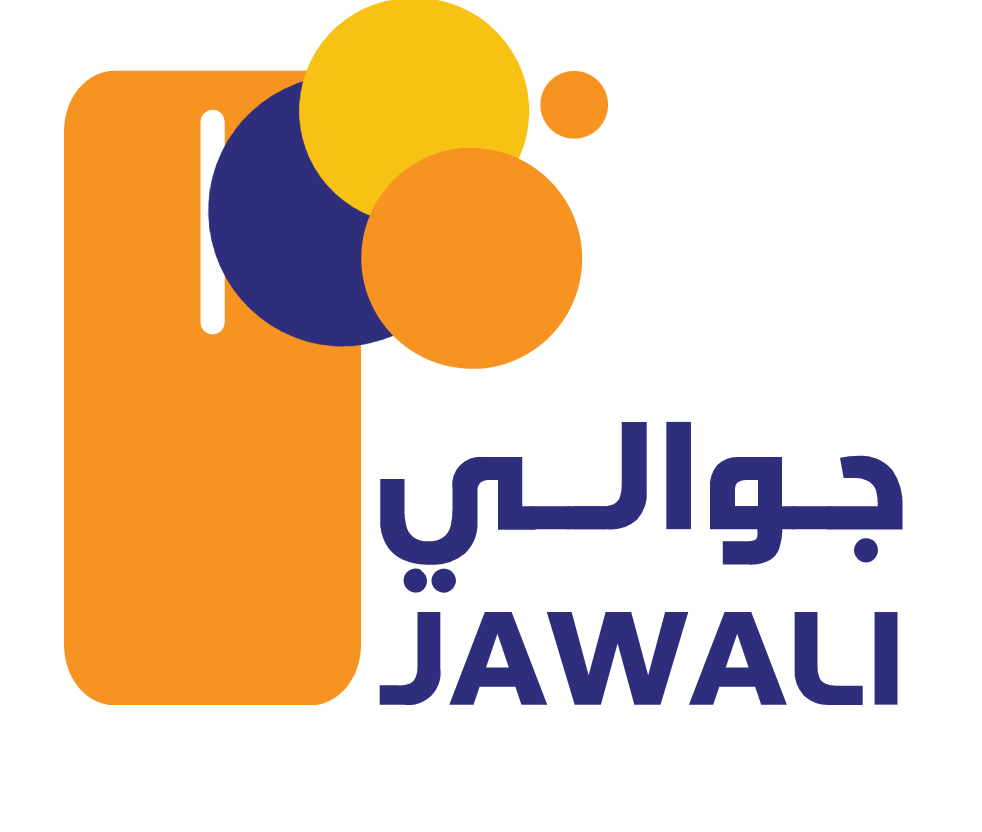

# Jawali Payment



Jawali Payment is a Node.js package for interacting with the Jawali payment gateway. It provides a simple API to perform operations like ecommerce inquiry and cash out.

---

## Installation

First, install the package via npm:

```bash
npm install @alsharie/jawalijs
```

---

## Configuration

Create a configuration object with your gateway credentials and URL. For example:

```js
const config = {
  auth: {
    phone: '',
    username: '',
    password: '',
    org_id: '',
    user_id: '',
    external_user: '',
    wallet: '',
    wallet_password: '',
    wallet_identifier: '',
  },
  url: {
    base: '',
    disableSslVerification: true, // set to false if you want SSL verification enabled
  },
};

this.jawali = new JawaliGateway(config);
```

In the configuration above, the `disableSslVerification` flag is used to control SSL behavior.

---

## Usage Example

Below is an example of how to perform an ecommerce inquiry and then a cash out (ecommca shout). This example demonstrates how to use the provided response classes and handle different response states.

```js
import {
  JawaliEcommcaShoutResponse,
  JawaliEcommerceInquiryResponse,
  JawaliGateway,
} from '@alsharie/jawalijs';

async function requestPayment() {
  try {
    const voucher = 'xxxxx';
    const phone = '7xxxxxxxx';
    const note = '';
    const price = 1000;
    const currency = 'YER';

    // Perform an ecommerce inquiry
    const data = await this.jawali.ecommerceInquiry(voucher, phone, note);

    if (data instanceof JawaliEcommerceInquiryResponse && data.isSuccess()) {
      // Check if the state is "PENDING" and the amount and currency are correct
      if (data.getState() === 'PENDING') {
        if (data.getAmount() == price && data.getCurrency() === currency) {
          // Perform cash-out using ecommcaShout
          const ecommcaShout = await this.jawali.ecommcaShout(voucher, phone, note);

          if (ecommcaShout instanceof JawaliEcommcaShoutResponse && ecommcaShout.isSuccess()) {
            return {
              message: 'تم تحويل المبلغ بنجاح',
              success: ecommcaShout.isSuccess(),
              data: ecommcaShout.getResponse(),
            };
          } else {
            return {
              message: 'حدث خطأ أثناء تحويل المبلغ',
              success: ecommcaShout?.isSuccess?.() || false,
              data: ecommcaShout?.getResponse?.(),
            };
          }
        }
      } else {
        return {
          message: 'تم تحويل المبلغ من قبل',
          success: data.isSuccess(),
          data: data.getResponse(),
        };
      }
    } else {
      return {
        message: 'حدث خطأ أثناء التاكد من قيمة المبلغ',
        success: data?.isSuccess?.(),
        data: data?.getResponse?.(),
      };
    }
  } catch (error) {
    return error;
  }
}
```

### Explanation

- **ecommerceInquiry**  
  This method contacts the gateway to verify payment details. The response is an instance of `JawaliEcommerceInquiryResponse` if successful.

- **ecommcaShout**  
  When the inquiry indicates a pending state with the correct amount and currency, the `ecommcaShout` method is called to complete the cash-out. Its response is wrapped in the `JawaliEcommcaShoutResponse` class.

- **Response Handling**  
  Use `instanceof` checks to verify the type of the response. Then call methods like `getAmount()`, `getCurrency()`, `getState()`, and `getResponse()` to access the details.

---

## License

This project is licensed under the MIT License. See the LICENSE file for more details.
```